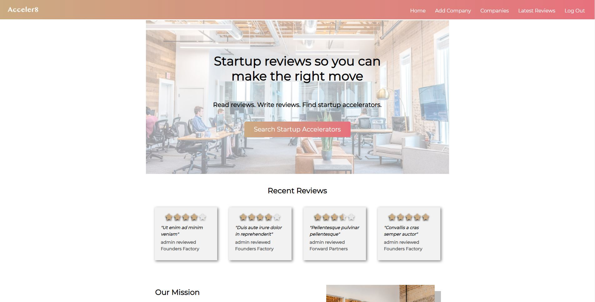

# Acceler8

Acceler8 is a review platform for startup accelerators in the UK. By gathering feedback shared by startups, Acceler8 informs 
the decisions of others and helps ensure that future startups partner up with a company that best suits their needs. In addition 
to inviting written reviews, Acceler8 incorporates a five-star rating system, which can be used to rate companies with regards to 
mentorship, hiring, community, fundraising, and corporate development.

Each startup accelerator has its own company page, containing a company bio and other necessary information. This page also provides 
access to the latest reviews for the company, while displaying the company's average score in each of the five aforementioned 
categories, as well as its overall score based on all user feedback provided. In addition to posting reviews, users can update and 
remove reviews. The creation of company accounts, and any subsequent updates to said accounts, are limited to the administrator.

This repository contains the source code used to create an MVP version of the Acceler8 site. The design of this site has not been 
optimised for mobile devices. This is in part down to time restraints, but also as this application isn't considered one that you 
would typically access on a mobile phone.

## Features

- Login/registration: By registering and logging into a secure account, users are able to provide feedback on listed startup accelerators.
- CRUD functionality: Registered users are able to create, read, update and delete reviews. The same functionality is available to site 
administrators with regards to company accounts.
- Review form with rating system: Before submitting a review, users are asked to rate the company out of five with regards to 
mentorship, hiring, community, fundraising, and corporate development.
- Dynamic five-star display: The ratings provided are then used to calculate the overall rating accompanying the individual review. They are 
also added to the database to contribute to the company's average score in each category, and its average score overall. These scores are 
displayed on the startup accelerator's company page via a dynamic five-star display, written using inline python.

## Technologies used

- Python: The underlying code, including views, models, forms, routes, and the majority of functionality, was written using Python.
- Django: This project was written using the Django web framework. Django authentication was used to create a secure registration and 
login feature.
- Bootstrap: The Bootstrap front-end web framework was used to help structure the website.
- Javascript/jQuery: Javascript and jQuery logic have been used to develop certain pieces of dynamic functionality, specifically the 
customisation of radio buttons in the review form to create a responsive five-star rating system. 
- HTML: HTML was used to help structure the website.
- CSS: The appearance of the website was enhanced using CSS. The stylesheet is available in the static folder.
- SQL: All data inputted into the website by administrators and users is saved to a Postgresql database.

## Deployment

The final project was pushed to Github, before being deployed to Heroku by way of connecting to the Github workspace. A Heroku Postgres 
database was included as an add-on when setting up the app in Heroku. Heroku came with its own database URL within config variables, which I 
was required to replicate within the env.py file, before copying the remaining config variables from the env.py file to Heroku.

Certain settings within the settings.py file were reconfigured so that static and media files would be hosted within and imported into a 
cloud-based S3 bucket created using Amazon Web Services. 'gunicorn' was installed via the bash terminal to allow the project to connect to 
Heroku, and 'psycopg2' was installed to enable the project to interact with the SQL database. The requirements.txt file was duly updated. A 
Procfile was added to convey to Heroku the type of app that it is hosting. Finally, 'acceler8.herokuapp.com' was added to the allowed hosts 
within the settings.py file and pushed to git, to authorise Heroku as a host, before deploying the master branch.

A live demo version of this application can be found at: https://acceler8.herokuapp.com/
